관통 프로젝트 제출 방법

기존의 readme.md는 readme_version_번호.md로 변경하고 <strong>새로운 readme.md가 처음에 보이도록</strong> 해주세요.
 
# 관통프로젝트: HappyHouse_DB_서울_14반_이희준_허지은 
### 제출일: 2020.04.27

### 참여 페어
- 이희준, 허지은

### 처리된 요구사항 목록
  
|난이도|구현기능|세부기능|작성여부|캡쳐|
|:---:|:---:|:---:|:---:|:---:|
|기본|메인페이지| |O|O|
|기본|회원관리|회원정보 등록화면|O|O|
|기본|회원관리|회원정보 수정화면|O|O|
|기본|회원관리|회원정보 삭제화면|O|O|
|기본|회원관리|회원정보 검색화면|O|O|
|기본|로그인/로그아웃| |O|O|
|기본|실거래가 검색,결과|전체검색화면|O|O|
|기본|실거래가 검색,결과|상세검색화면|O|O|
|기본|실거래가 검색,결과|동별화면|O|O|
|기본|실거래가 검색,결과|아파트별검색화면|O|O|
|추가|비밀번호 찾기/사이트맵/메뉴구성 화면|비밀번호찾기화면|O|O|
|추가|비밀번호 찾기/사이트맵/메뉴구성 화면|사이트맵구현| | |
|추가|비밀번호 찾기/사이트맵/메뉴구성 화면|메뉴구성|O|O|
|추가|관심지역 동네 업종 정보| | | |
|추가|관심지역 대기오염 정보| | | |
|심화|웹사이트 소개/공지사항 관리 화면| | | |
|기본|알고리즘을 2개이상 적용|리스트 정렬|O|O|
|기본|알고리즘을 2개이상 적용|문자열 패턴 검색|O|O|

* 개별 창작으로 추가 구현한 기능을 표에 추가시키세요.
* 알고리즘이 적용된 source와 실행 화면을 캡쳐해서 제출하세요.

### usecase
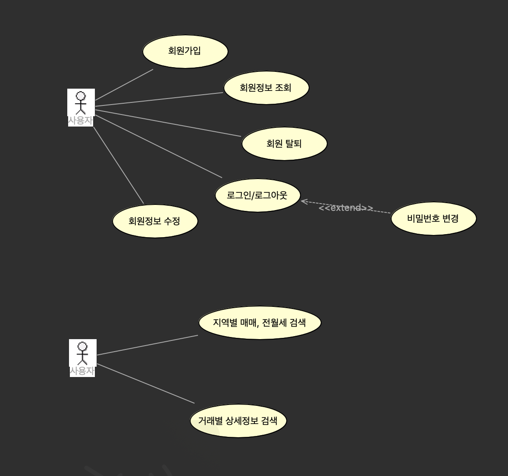

## 클래스다이어그램
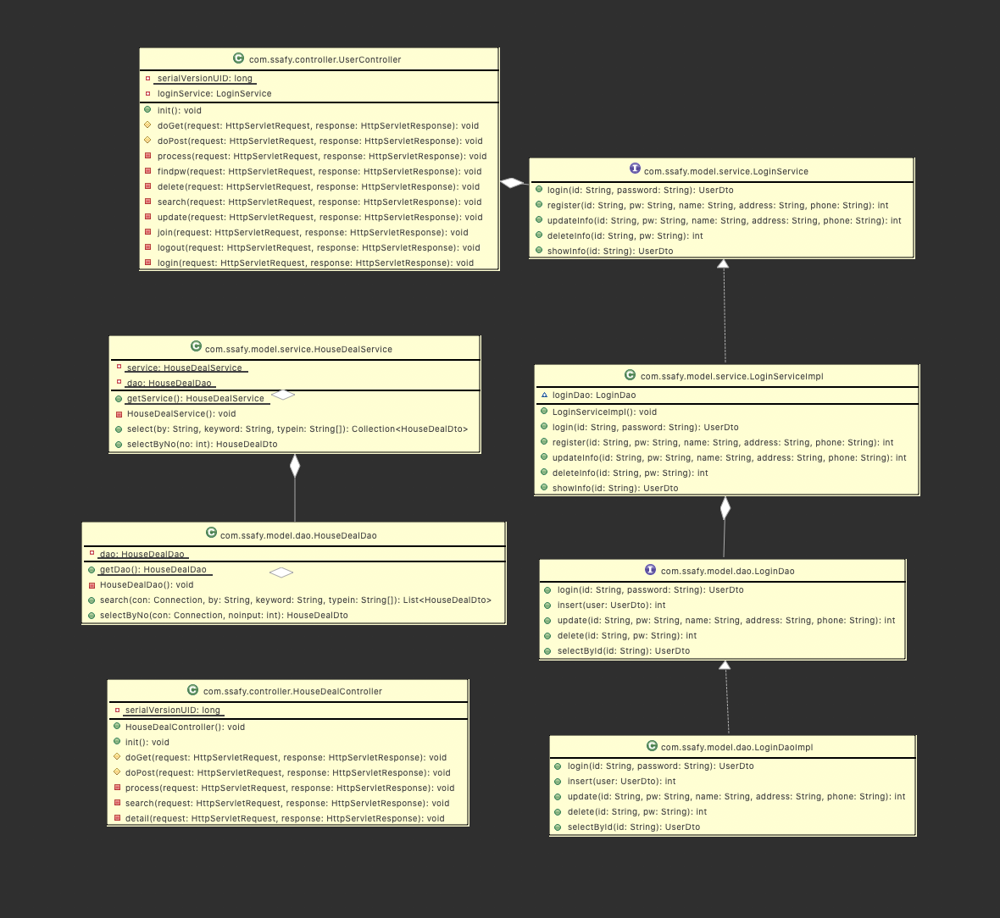

### 실행화면 캡쳐 - 

TODO: 요구사항 목록에서 완료 처리된 사항의 캡쳐 이미지를 등록하세요.

#### - 메인 페이지
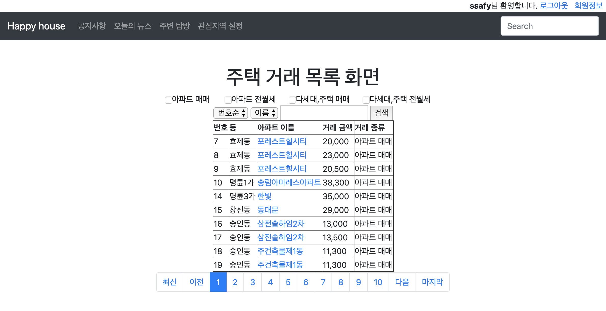

#### - 회원관리/회원정보 등록화면
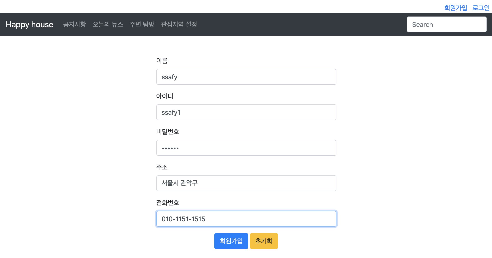

#### - 회원관리/회원정보 수정화면,삭제화면
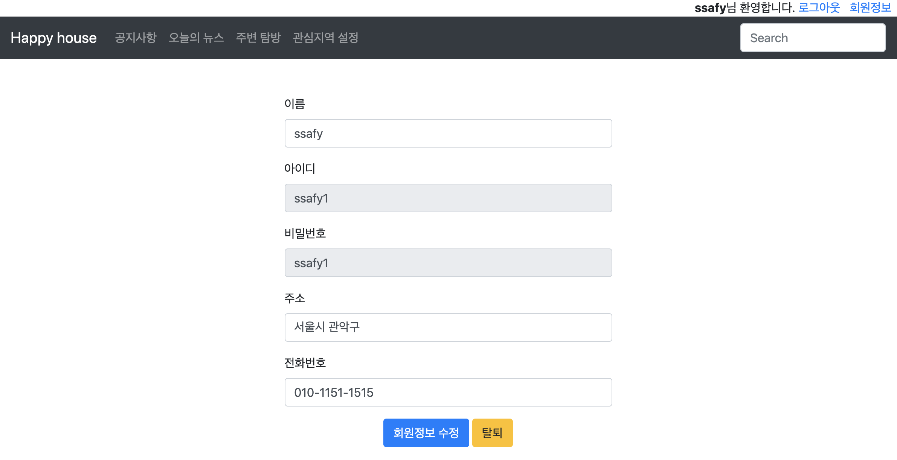

#### - 회원관리/회원정보 검색화면
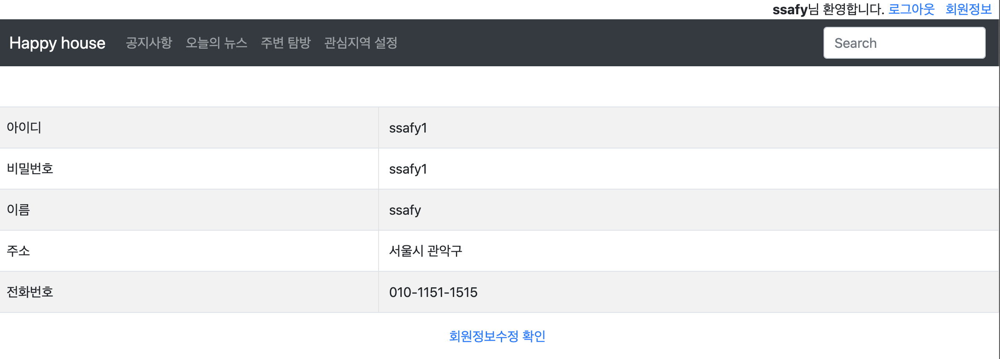

#### - 비밀번호 찾기화면
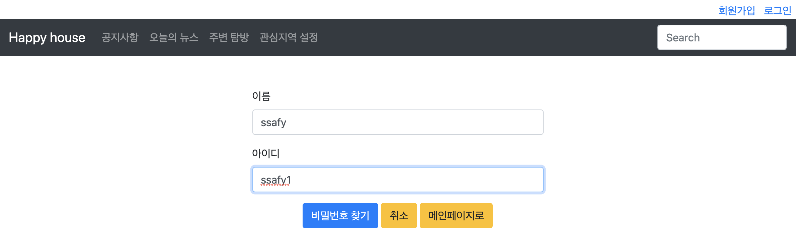
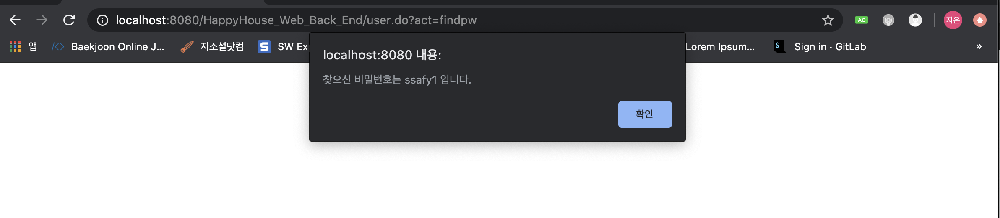

#### - 로그인 로그아웃
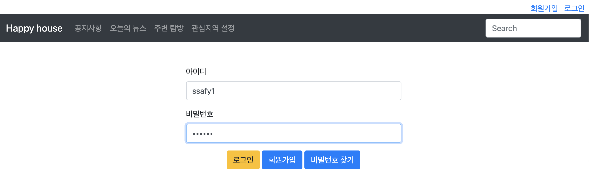

#### - 실거래가 검색,결과/전체검색화면
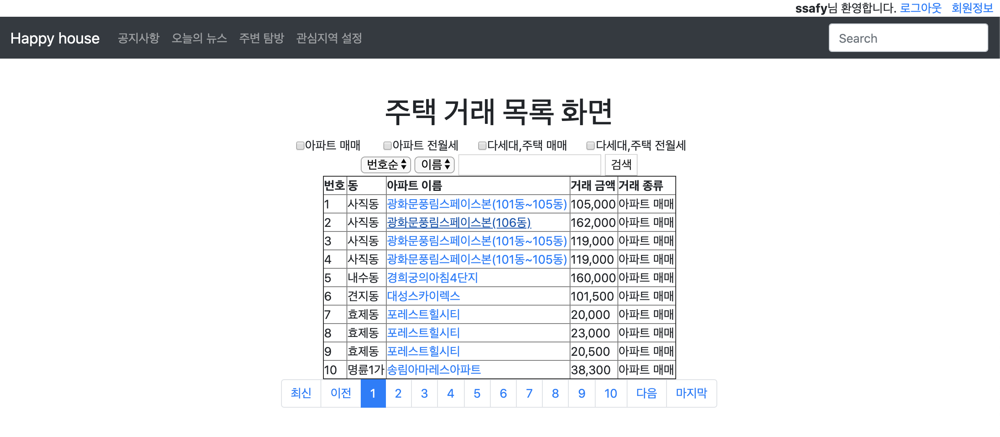

#### - 실거래가 검색,결과/상세검색화면
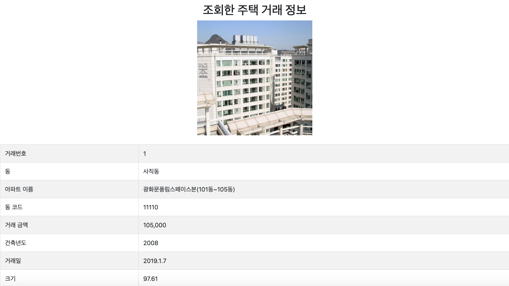

#### - 실거래가 검색,결과/동별화면
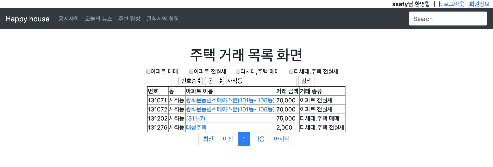

#### - 실거래가 검색,결과/가격별화면
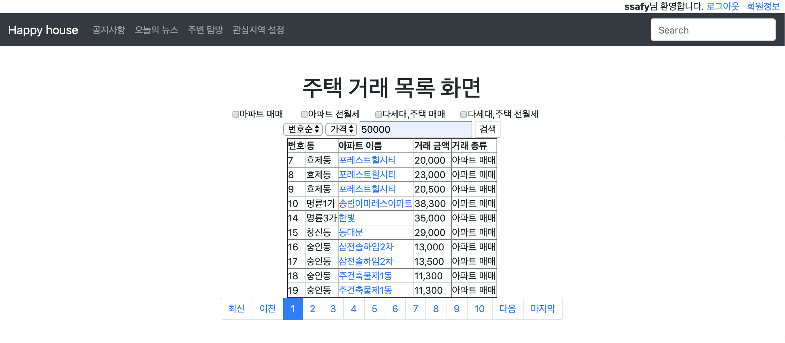

#### - 실거래가 검색,결과/아파트별 검색화면

#### - 실거래가 검색,결과/거래별 검색화면
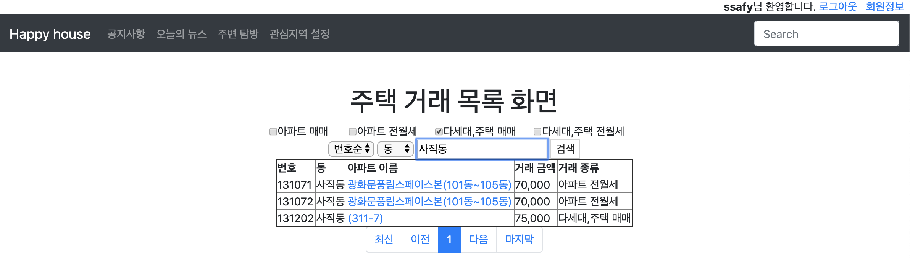
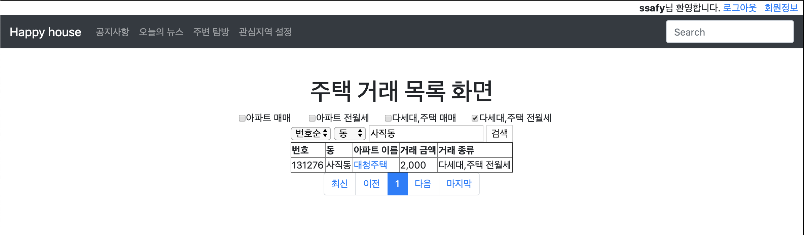
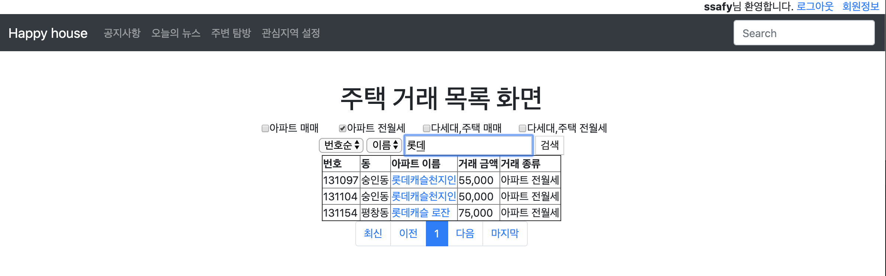

